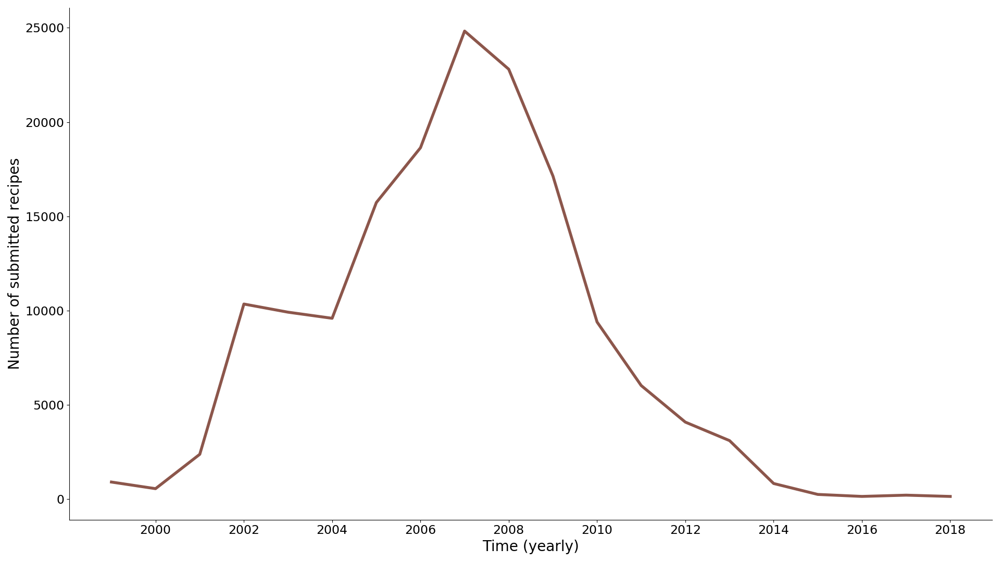
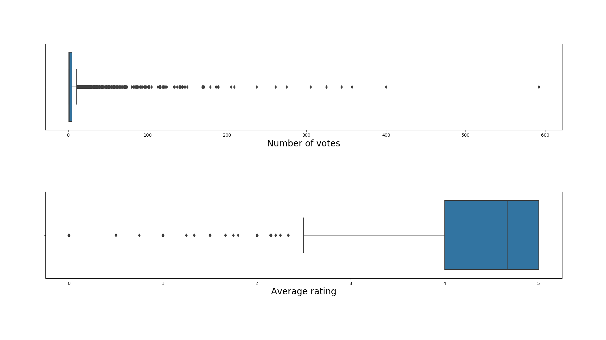
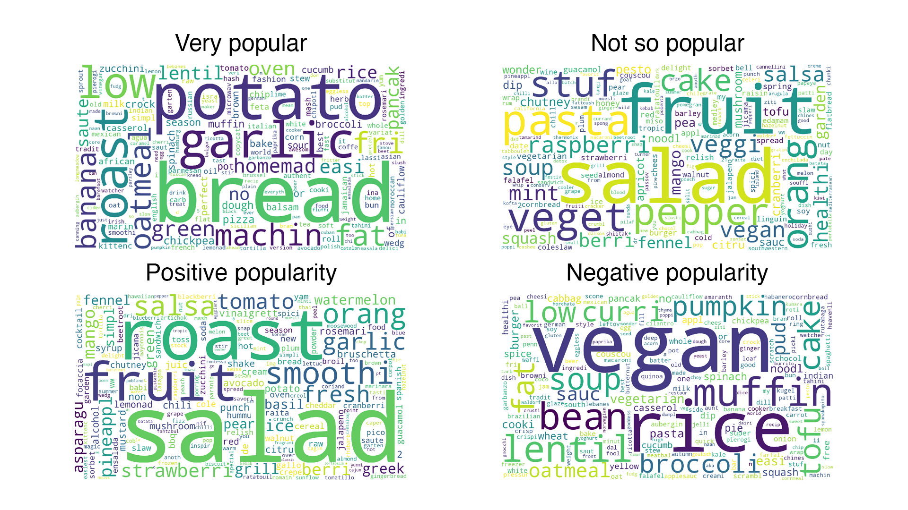

You can find our video about analyzing this dataset [here](https://www.youtube.com/watch?v=XtfC3p_dYtA&t=14s) 

## The dataset

Our dataset was obtained from the following Kaggle competition:

https://www.kaggle.com/shuyangli94/food-com-recipes-and-user-interactions 

> This dataset consists of 180K+ recipes and 700K+ recipe reviews covering 18 years of user interactions and uploads on Food.com (formerly  GeniusKitchen)

## The question

With this dataset we aimed to determine what the perfect recipe was so we could feast on it after our quarantine is over.

For this we had to determine the type of cuisine we wanted to focus on, the name of our recipe, the ingredients and the preparation of the recipe.

## The approach

First we filtered out recipes that take more than 5h and desserts. 

### Types of cuisine

Then we explored the popularity of different types of cuisine measured as the % of total recipes containing that tag. 

 

We decide to focus on healthy and vegetarian cuisine since it seems like these have the highest and most constant popularity.

The decline in percentage for all tags can be explained by a general reduction in the number of recipes and in the tags per recipe.

### Name

After that we looked at what name to use for the recipe taking into account the most popular recipes for this we define very/not so popular as given by the number of votes and positive/negative given by the average rating. Using the top and bottom quartile to split the data.

We then plotted each group as a wordcloud.

And from this concluded with 'Roasted potatoes and garlic with bread' as our name.

### Ingredients

Next it was time to decide the ingredients. We included potatoes, garlic and bread and then we analyzed how many ingredients recipes with average rating > 4.5 and with at least 500 votes had. The number turned out to be 9 so we decided we’d choose 9 ingredients. 

First, we analyzed the most popular ingredients, for this we used a counter to see the most used ingredients and picked the top-2 (salt and olive oil). 

Then we look at the popularity evolution of non-condiment ingredients and decide to add tomato and onion to our recipe due to their high and continued popularity.

Next we trained a linear regression model on the recipes using the ingredients as features and the standard deviation as the label. This was done with the purpose of then exploring the weights of different ingredients to find which ones had highest values (which meant they led to high standard deviations, therefore meaning controversial ingredients) and which ones had the lowest values. 

From this we extracted another two ingredients, agave syrup and black vinegar. And then we decided two more ourselves to complement the ones chosen automatically.

 

Regarding the steps to follow we decided to keep it simple and trust the reader’s ability to mix up the ingredients and cook them up themselves.

 

 
